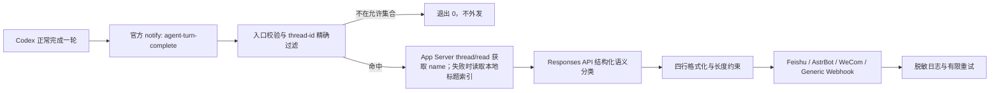

# 技术设计

## 目标与非目标

本工具只为配置中的 Codex 根线程，在每轮**正常完成**后发送一次通知。它必须做到：生命周期事件触发、线程 ID 精确过滤、模型语义分类、固定四行输出、Windows 一键安装和可恢复配置修改。

它当前不承诺：捕获 `failed`/`interrupted`；监听所有 App Server 连接的全局事件；从自然语言关键词推断状态；控制个人微信或 QQ 客户端。QQ 与个人微信可由 AstrBot 的官方平台适配器负责，本工具只调用 AstrBot 的受权主动消息接口。

## 架构



### 触发层：Codex `notify`

用户级 `~/.codex/config.toml` 指向稳定入口：

```toml
notify = ["python", "<项目绝对路径>/progress-notify.py"]
```

Codex 会把单个 JSON 对象作为最后一个命令行参数传入。入口只接受 `type == "agent-turn-complete"`，并读取官方字段 `thread-id`、`turn-id`、`cwd`、`input-messages` 与 `last-assistant-message`。

**顺序边界：** `notify` 可能在 App Server 正式广播 `turn/completed` 前启动。不过，`agent-turn-complete` 表示模型已停止，并且 `Stop` Hook 请求的 continuation 已结束。外发动作不应等待或轮询 App Server 的状态变化；App Server 在这里仅用于无副作用的标题查询。

**终止边界：** App Server 将 `turn/completed` 的 `turn.status` 定义为 `completed | interrupted | failed`，但 `notify` 文档目前只声明 `agent-turn-complete`。因此实现对正常完成提供保证；取消和失败不保证。若未来需要完整审计，应构建拥有该 App Server 连接的宿主客户端，持续消费 `turn/completed`，而不是推测日志或轮询桌面数据库。

### 线程过滤

配置加载器把逗号分隔字符串或 JSON 数组规范化为非空 ID 集合。过滤条件只有：

```text
event.thread_id ∈ configured_thread_ids
```

不允许 `contains`、前缀、大小写模糊、glob 或正则。标题、用户输入、助手输出均不参与选择。此规则避免标题改变、重名和文本碰撞。

### 标题查询

顺序如下：

1. 启动 `codex app-server`，完成 `initialize`/`initialized` 握手，然后调用稳定的 `thread/read`，读取 `result.thread.name`；
2. 配置中的 `title_overrides_json[thread_id]` 兜底；
3. 事件自带标题（若未来版本提供）；
4. 从 `CODEX_HOME/session_index.jsonl`（默认 `~/.codex/session_index.jsonl`）逐行读取精确 `thread_id` 的最后一条有效非空 `thread_name`；损坏、字段无效或并发写入尚未完成的行直接忽略；
5. `未命名对话（<thread_id>）`。

`thread/read` 不恢复、不订阅也不加载线程，适合作为只读元数据接口。标题查询有短超时；失败只导致回退，不影响通知。本地 JSONL 是桌面端实现细节，因此永远排在官方接口、显式覆盖和事件字段之后；读取失败同样静默降级，不枚举或记录其他线程标题。

### 进度分类

分类器把有界事件上下文发送给配置的 Responses API：事件类型、对话标题、最多最后 8 条输入消息（每条仅保留尾部 4000 字符），以及助手回复尾部 50000 字符。这样限制请求大小，但相关内容仍会离开本机并到达 `OPENAI_BASE_URL`。分类器要求返回严格 JSON：

```json
{
  "status_kind": "停滞|阻塞|路线选择|完成|待人工测试|待审批|自定义",
  "custom_status": "标准状态均不准确时填写的短状态，否则为空字符串",
  "details": "不超过50个Unicode字符的事实摘要"
}
```

提示词要求基于整体语义和明确行动状态判断，禁止通过本地关键词/正则匹配。实现对返回对象做类型与长度验证，但不从文本二次猜测。

- 优先使用六个标准枚举；均不准确时使用模型生成的自定义短状态；
- 所有状态在本地清理为单行并限制为 12 个 Unicode 字符；
- 所有 `details` 在本地清理为单行并限制为 50 个 Unicode 字符；
- Responses 分类首轮使用 1024 个输出 token；仅在服务明确报告输出额度耗尽时，以 2048 个 token 重试一次；
- 无 API Key、超时、HTTP/JSON/结构错误时使用“情况未知”和固定短提示，不复制助手回复；
- 分类失败不会阻断通知。

`classifier.mode = "disabled"` 时完全跳过 Responses API，返回“情况未知 / 未启用进度分析，请打开 Codex 查看本轮结果。”；内容随后仍会发送到用户配置的通知通道。

测试使用本地假 Responses HTTP 服务，不访问 OpenAI。

### 格式化

内部对象包含 `title`、`progress`、`detail`、北京时间。面向用户的格式化器输出结构固定、内容动态的四行纯文本摘要：

```text
对话名称：{title}
当前进度：{progress}
进度详情：{detail，最多50字}
本条消息时间：{YYYY-MM-DD HH:mm:ss}（北京时间）
```

换行、回车和不可见控制字符从动态字段中折叠为空格，防止破坏“四行”契约；Markdown 标记被移除。北京时间使用 IANA `Asia/Shanghai` 或固定 UTC+08:00；不依赖机器本地时区。

### 通知器

- `feishu`：向飞书自定义机器人发送 `{"msg_type":"text","content":{"text":"..."}}`。开启签名校验时，在请求体加入 Unix 秒级 `timestamp`，并按飞书规则使用 `timestamp + "\n" + secret` 生成 HMAC-SHA256/Base64 `sign`。`code == 0` 或兼容响应 `StatusCode == 0` 才视为成功。
- `wecom`：发送 `{"msgtype":"markdown_v2","markdown_v2":{"content":"..."}}`；正文不超过 4096 UTF-8 字节；HTTP 非 2xx、无效 JSON 或 `errcode != 0` 均失败。
- `generic`：发送顶层版本化事件信封，包含 `schema_version`、固定 `event`、确定性 UUIDv5 `event_id`、对话 ID/名称、进度、详情、ISO 北京时间、时区和四行 `text`；HTTP 非 2xx 失败。
- `astrbot`：向 AstrBot 4.24.2+ 的核心 `POST /api/v1/im/message` 兼容入口发送 `{"umo":"...","message":"四行正文"}`；Bearer API Key 只需 `im` scope。响应必须是 JSON 对象且 `status == "ok"`，否则视为失败。UMO 必须从目标会话的 `/sid` 获取，不能根据 QQ 号、微信号或平台名称自行拼接。
- 生产只允许 HTTPS；显式配置后仅允许回环地址使用 HTTP，方便自动化测试。
- 支持超时、有限次数重试和退避；4xx 配置错误可直接失败，暂时性网络错误及 5xx 可重试。
- 日志不得记录完整通知端点、飞书签名密钥、Bearer token、HMAC secret 或 OpenAI Key。

Generic HMAC-SHA256 对 `ASCII Unix 时间戳 + "." + 实际 UTF-8 JSON 请求体` 签名，并发送 `X-Progress-Timestamp` 与 `X-Progress-Signature: sha256=<hex>`。接收端以 `event_id` 作为幂等键。

### 安装器

安装器解析 TOML 的顶层 `notify` 并执行幂等更新：

1. 读取原文件原字节；
2. 若已有本工具命令则不重复插入；
3. 若存在其他 `notify`，保存可恢复记录和带时间戳备份；
4. 原子替换配置文件；
5. 卸载时仅当当前值仍属于本工具才恢复原值，避免覆盖用户安装后的新修改。

安装和卸载后必须重启桌面应用。配置文件中的其他注释、键与换行风格应尽量保持不变。

## 数据流与失败策略

| 阶段 | 失败处理 | 是否外发 |
| --- | --- | --- |
| 事件 JSON 无效 | 记脱敏错误并非零退出 | 否 |
| JSON 有效但事件类型不支持 | 正常忽略 | 否 |
| 线程不在允许集合 | 正常退出 | 否 |
| 标题读取失败 | 使用覆盖、事件、本地索引或 ID 兜底 | 是 |
| 分类失败/无 Key | “情况未知”及不超过 50 字的固定提示 | 是 |
| 格式化失败 | 非零退出并记录 | 否 |
| 通知通道失败 | 有限重试，最终非零退出 | 已尝试 |
| dry-run | 输出/记录负载 | 否 |

## 安全

- 通知端点和 API Key 仅从环境变量或本机配置获得；AstrBot Key 使用最小 `im` scope；
- 日志做 URL 查询串与授权头脱敏；
- 通用附加请求头必须是 JSON 对象，拒绝换行字符；
- 不执行事件内容，不拼接 shell 命令；
- App Server 使用参数数组启动，JSON-RPC 走 stdin/stdout；
- 默认拒绝明文远程 HTTP；
- 测试服务器只绑定 `127.0.0.1`，测试从不真实外发。

## 可演进路线

如必须覆盖 `failed` 和 `interrupted`，需要改变部署模型：让本工具成为发起/拥有 Codex App Server 会话的客户端，并对指定线程订阅 `turn/completed`。桌面应用内部连接的事件没有被官方说明为可由外部旁路订阅，因此不能仅启动第二个 App Server 进程就假定能收到桌面的全部事件。这是明确的架构变更，不属于当前 `notify` 方案。
